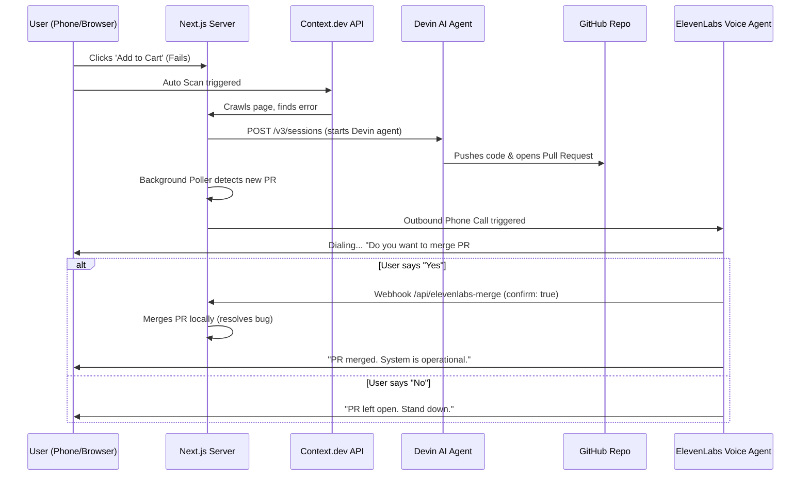

# Connecting Context.dev Detection to Devin & ElevenLabs Call Loop

This document explains how to wire the automatic Context.dev error detection to trigger a Devin hotfix session, and automatically make a phone call to you using **ElevenLabs** once the Pull Request is created, allowing you to merge the PR voice-interactively on the phone call.

---

## Complete Workflow Overview



---

## Setup Instructions

### Step 1: Configure Environment Variables
Add your Devin and ElevenLabs credentials to your `incident-dashboard/.env.local` file:

```env
# Devin API Keys (Service API Key)
DEVIN_API_KEY=cog_your_service_user_api_token_here
DEVIN_ORG_ID=your_organization_id_here

# ElevenLabs Telephony Keys
ELEVENLABS_API_KEY=your_elevenlabs_api_key_here
ELEVENLABS_AGENT_ID=your_conversational_agent_id_here
ELEVENLABS_PHONE_NUMBER_ID=your_twilio_number_id_configured_in_elevenlabs_here
USER_PHONE_NUMBER=+1234567890 # Your phone number to call
```

### Step 2: Configure ElevenLabs Conversational Voice Agent
1. Go to [ElevenLabs Conversational AI](https://elevenlabs.io/app/conversational-ai).
2. Create a new Conversational Agent (e.g. name it "On-Call Assistant").
3. Set the **First Message** to:
   *"Hey there! I am your Devin on-call assistant. I detected a TypeError in calculateUserDiscount and opened a pull request on your GitHub. Do you want me to merge it?"*
4. Select a telephony phone number from the **Phone Numbers** tab (connect your Twilio account SID and Auth Token to buy/link a number).

### Step 3: Add the "Merge PR" Webhook Tool in ElevenLabs
To allow the agent to merge the PR when you say "yes", add a custom tool in your ElevenLabs Agent configuration:

1. Click **Add Tool** > **Custom Webhook**.
2. Name the tool: `merge_pull_request`.
3. Set the description: `Call this tool to automatically merge the Devin hotfix pull request when the user approves or says yes.`
4. Set the Webhook URL:
   * **Local testing (with ngrok)**: `https://<your-ngrok-subdomain>.ngrok-free.app/api/elevenlabs-merge`
   * **Production**: `https://<your-domain>.com/api/elevenlabs-merge`
5. Set Method: `POST`.
6. Define parameters (JSON schema):
   ```json
   {
     "type": "object",
     "properties": {
       "confirm": {
         "type": "boolean",
         "description": "Set to true if the user confirmed or said yes to merge the pull request."
       }
     },
     "required": ["confirm"]
   }
   ```

---

## Running and Testing the Flow

### Option A: Real Call Flow (Requires Keys & Public Tunnel)
1. Expose your local server using ngrok:
   ```bash
   ngrok http 3000
   ```
2. Put the ngrok URL in the ElevenLabs Webhook Tool settings.
3. Trigger the bug by clicking **Add to Cart**.
4. Context.dev will scan and trigger Devin.
5. As soon as Devin pushes the PR, the background poller will detect it, and your phone will ring!
6. Say **"Yes, merge it"** to the voice assistant. The assistant will call the webhook, hotfix the code, and clear the error!

### Option B: Local Simulation Flow (No Keys Required)
If you don't have Twilio/ElevenLabs setup configured, the system automatically falls back to **Simulation Mode**:
1. When you trigger the error, Context.dev scans and logs a simulated Devin trigger.
2. After 5 seconds (simulating Devin writing code), it logs the outbound call simulation:
   ```
   📞 [ElevenLabs Simulation] Dialing user at +1XXXXXXXXX...
   📞 [ElevenLabs Simulation] "Hey, I've solved the code issue and sent a Pull Request. Do you want to merge it?"
   ```
3. A floating **"Devin Call Simulation"** prompt will appear in the page console, allowing you to type or simulate a "Yes/No" response to complete the local self-healing hotfix demo!
