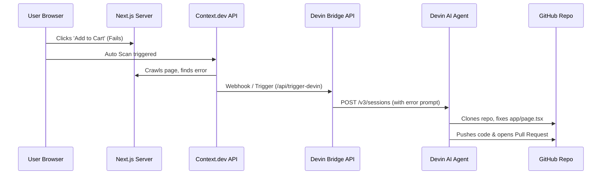

# Connecting Context.dev Detection to Devin

This document explains how to wire the automatic Context.dev error detection to trigger Devin programmatically, allowing Devin to automatically ingest error details, fix the codebase, and push a Pull Request to your GitHub repository.

---

## Architecture Overview



---

## Setup Instructions

### Step 1: Configure Environment Variables
To authorize the bridge to contact Devin's API, add your Devin credentials to your `incident-dashboard/.env.local` file:

```env
# Devin API Keys
DEVIN_API_KEY=cog_your_service_user_api_token_here
DEVIN_ORG_ID=your_organization_id_here
```
> **How to get keys:**
> 1. Go to [app.devin.ai](https://app.devin.ai) > **Settings** > **Service Users**.
> 2. Create a new service user token with `ManageOrgSessions` permissions.
> 3. Retrieve your **Organization ID** from the URL of your Devin workspace.

### Step 2: Push your Code to GitHub
Ensure you push your current local codebase to your GitHub repository:
```bash
git add .
git commit -m "feat: Sentry removed, Context.dev and Devin bridge integrated"
git push origin main
```

### Step 3: Trigger Devin Programmatically
The application includes a bridge endpoint `/api/trigger-devin`. 
When Context.dev scans the page and detects an exception, it automatically calls this endpoint with the payload:

```json
{
  "message": "TypeError: Cannot read properties of undefined (reading 'profile')",
  "location": "calculateUserDiscount (app/api/trigger-incident/route.ts:7:15)"
}
```

The bridge will formulate the following prompt and call Devin's session API:
> *"Please fix the following runtime error in the repository: TypeError: Cannot read properties of undefined (reading 'profile') at calculateUserDiscount (app/api/trigger-incident/route.ts:7:15). Fix the file, run tests/build to verify it works, and push the hotfix as a Pull Request."*

### Step 4: Track Devin's Session
The console in Developer Tools (Ctrl+Shift+I) will print the returned session URL:
```
✅ [Devin Bridge] Devin session successfully triggered!
🔗 Track session here: https://devin.ai/sessions/your-session-id
```
Devin will clone the repository, patch the error in `app/page.tsx` or the target route, verify the build, and automatically open a PR in your GitHub repository.
